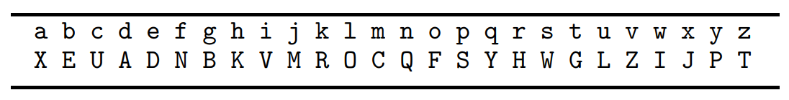
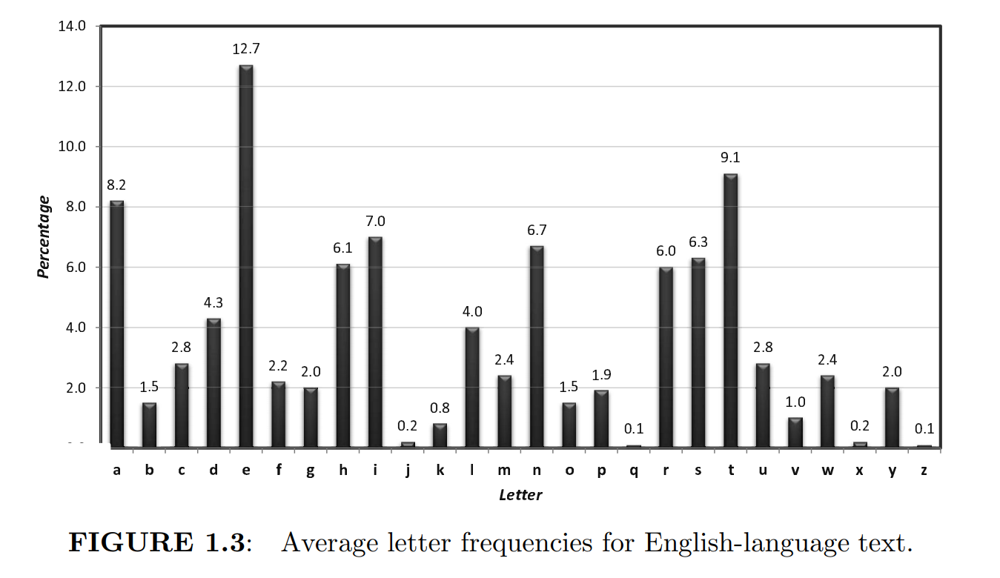

# README

## 概述
本文档使用免疫遗传算法来破解置换加密算法。在下文先提出破解置换加密算法的经典算法，再给出一个免疫遗传算法。为了方便，本文讨论的字符集都限定在英文字母，但不难推广到更大的字符集。

### 置换加密算法
对于字符集$\Sigma$，可以找到一个$\Sigma$上的置换$P$。使用置换$P$对明文$m$进行加密，其方法是：

**对于$m$中的每个字符$c$，将其转换为$P(c)$**

置换$P$即是该加密算法的密钥。显然，密钥空间$K$的大小为
$$
K = |\Sigma|!
$$
例如对于英文原文，字符集可认为是$26$个小写字母，则密钥空间的大小为$26!=403291461126605635584000000 \approx 4 \times 10^{26}$。

### 经典密码破解算法

#### 枚举密钥
如果可能的密钥不多，可以通过枚举所有密钥来对密文进行解密，解密结果中一定会有明文。该算法复杂度为$O(|K|)$，其中$K$是密钥空间。该算法可用于破解诸如凯撒加密及其变种的加密算法。但对于置换加密算法，其密钥空间很大，枚举密钥是不可接受的。

#### 词频分析
词频分析是针对诸如置换加密这类，字符频率信息不被破坏的加密算法的有效算法。其原理是：统计英文中各个字符出现的频率，然后再统计密文中各字符出现的频率，若在英文中字符$c$出现的频率与密文中字符$c'$出现的频率接近，则可以猜测$P(c)=c'$。通过这样的方法可以大量减少枚举量，可能可以快速得到解。

词频分析的缺陷在于，只有当密文足够长时，统计密文的字符频率才会足够接近英文中各字符出现的频率。而且如果密文本身涉及到某些专业领域，可能一些字符出现的频率会和英文中有较大出入。

## 免疫遗传算法破解置换加密算法

上文中的两种破解算法给了我们一些启发，我们可以设计一个免疫遗传算法在密钥空间中寻找解，而词频分析给了我们一种评估一个密钥好坏的方法。

### 问题参数及编码
在本问题中，我们的问题参数为密文$cipher$，而我们要做的就是解出明文$plain$。

如何编码呢？一个密钥$key$就是一个个体的 **染色体** ，因为密钥唯一确定了一个明文。

### 适应度函数
如何评估一个个体（密钥）对于密文$cipher$的适应度呢？上文提到词频分析是针对置换加密的一个有效手段，但只看一个字符出现的频率并不利于分析，我们很难得到有用的信息。

要解决的问题实际可以简单的看作：设$plain = Dec_k(cipher)$，即$plain$是密文$cipher$用密钥$key$解密出来的字符串。我们的适应度就设计为$plain$是英文的概率。

我们采用四元组词频分析来计算一个字符串是英文的概率。具体来说：我们先在大量的英文中（总计$n$个字符）统计任意连续四个字符$quad$出现的次数$cnt(quad)$，然后记该四元组是英文的概率为：$P(quad) = \frac{cnt(quad)}{n}$。采用四元组，是因为通过实验表明，用四元组来检测准确度是最高的。

那么对于一个长字符串，我们如何计算它是英文的概率呢？我们只需要把这个长字符串的每连续四个字符是英文的概率乘起来即可，例如字符串README是英文的概率为：
$$
P(\text{README}) = p(\text{READ}) \times p(\text{EADM}) \times p(\text{ADME})
$$
在实际中，由于统计数据不可能是完美的，某些四元组出现的次数可能为$0$，从而导致一个字符串被评估为：为英文的概率为$0$。为了避免这种情况，我们对概率取对数后作为个体的适应度，而对于没有出现过的四元组，我们取一个比$\log{\frac{1}{n}}$小的数作为其适应度。

根据对数的运算性质，一个字符串的对数概率是其所有连续四元组的对数概率之和。

### 免疫遗传算法

因为两个密钥之间并不具备可以交叉的信息，因此本算法只采取了变异操作。

初始随机生成$M=10^5$个抗体，免疫记忆库的容量为$N=200$，亲和系数为$\alpha = 0.7$

#### 选择

每次将免疫记忆库中的抗体按适应度降序排序，并定义第$i$个抗体的浓度为：
$$
C_i = \sum\limits_{j=0}^{25} [key_{i,j} = key_{i-1,j}]
$$
即为其与第$i-1$个抗体的密钥的对应位置值相等的位置数量，这样定义的原因是：相似抗体的适应度会比较接近。浓度概率简单定义为：
$$
{P_d}_i = \frac{C_i}{26}
$$

适应度概率采用基于适应度排名的线性概率：
$$
{P_f}_i = \frac{N-i}{N}
$$
需要注意，上面的所有式子的下标均从$0$开始

第$i$个抗体被选择的概率则为：
$$
\alpha {P_f}_i + (1-\alpha){P_d}_i
$$

#### 变异

变异方案是：选择密钥的两个位置$i,j$，然后交换这两个位置的值。显然一个抗体有$\binom{26}{2}$种可能的变异，对于每一种变异，若其为有益变异，则将其加入，若其为有害变异，则有$p_m=0.4$的概率被加入，这样可以避免陷入局部最优解。

在实现上，因为新抗体数量可能会很多，而每次都会进行淘汰，所以如果一个有害变异后的抗体的适应度低于当前免疫记忆库的最低适应度，其还是不会被加入。这样在保证算法正确性的前提下大幅提升了性能。

#### 终止策略

经过测试，如果免疫记忆库的最大适应度在连续$5$代中都没有变化，则我们可以认为找到了最优解。经过测试，长度为$117$的密文大约需要$14$次迭代；长度为$244$的密文大约需要$17$次迭代。

## 附录

### 统计数据

统计数据是来自于[Quadgram Statistics as a Fitness Measure](http://www.practicalcryptography.com/cryptanalysis/text-characterisation/quadgrams/#a-python-implementation)：

- 字符总数：$4224127912$
- 详细统计数据见english_quadgrams.txt

### 主程序说明
运行yahIGA.py程序后，输入密文文本文件名（与本程序在同一目录下），若无输入，则算法会破解样例数据，样例数据大概需要$2$分钟可完成破解。

### 辅助程序
项目目录下提供了一个Enc.py程序，运行后输入一段明文，其会用一个随机密钥加密，并输出密文，便于测试。

项目目录下提供了一个ngram_score.py程序，其作用是计算适应度。

## 注意事项
解密出的密文只保证其大概率是又英文书写，而不保证其语意正确。例如："helloworld"加密后，可能被本算法解密为"outthehats"，即为"out the hats"，这是一个可能的期望的最优解，而不是算法本身出现了问题。

本算法是基于词频分析设计的，因此在密文长度小于$30$时很难解出正确明文。

本算法的运行时间与密文长度是成线性正相关的，如果要解密很长的密文，可以选择只截取密文的一部分，对于长度在$100 \sim 300$的密文，本算法表现优异。

文中图片来自 *Introduction to Modern Cryptography*
